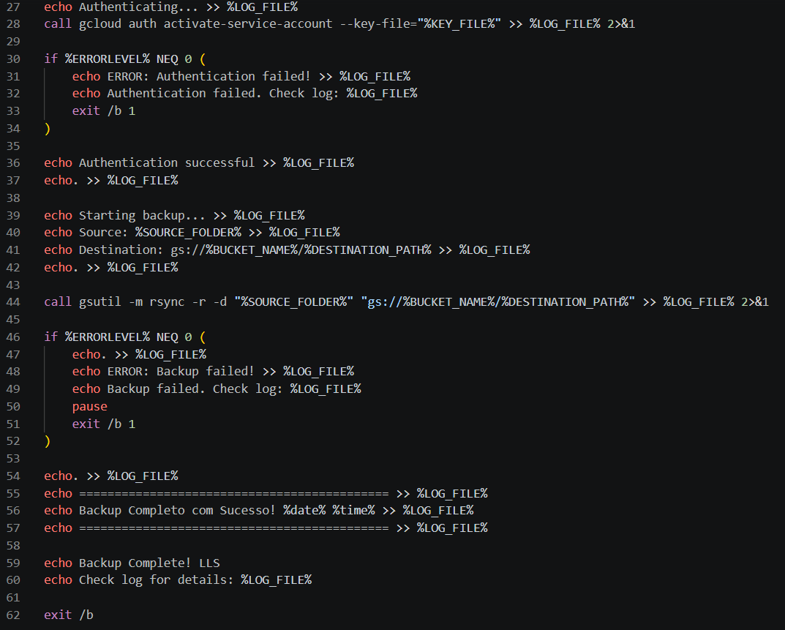

# WinLocal Backup Script v4

[Português](README.pt-BR.md) | [English](README.md)

<p align="center">
  
</p>

<p align="center">
  <em>Data loss is not an option. Automate your cloud backups with precision.</em><br>
  <strong>WinLocal Backup Script v4</strong> is a robust Windows Batch solution that integrates seamlessly with the Google Cloud SDK to mirror and archive your critical local files securely to the cloud.
</p>

<p align="center">
  
  
  
</p>

---

## What Is This?

**WinLocal Backup Script v4** is a Command-Line Interface (CLI) tool built in Windows Batch that leverages the power of `gsutil` (Google Cloud CLI) to automate local-to-cloud backups. 

Instead of relying on heavy third-party software, this script runs silently in the background, authenticates via a secure service account, and synchronizes your selected local directories directly to a Google Cloud Storage Bucket. 

## Core Features

| Feature | Description |
|---------|-------------|
| ☁️ **Direct Cloud Sync** | Utilizes `gsutil rsync` to upload only modified files, saving bandwidth and execution time. |
| 🛡️ **Soft Delete Ready** | Fully compatible with GCP's Soft Delete policies, protecting you from accidental overwrites or ransomware. |
| 📝 **Execution Logging** | Generates detailed `.log` files showing exactly which files were uploaded and their progress. |
| 📅 **Task Scheduler Integration** | Configurable for full "set-and-forget" automation via Windows Task Scheduler. |

---

## 🛠️ Complete Setup Guide

Follow these steps to set up your Google Cloud environment and configure the script on your local machine.

### Phase 1: Web Preparation (Google Cloud)

**1. Create a Bucket**
* Navigate to **Google Cloud > Cloud Storage > Buckets > Create Bucket**.
* Choose your Bucket Name and Server Region.
* Select your billing tier/storage class.
* **Important:** Check the box for **"Enforce public access prevention on this bucket"**.
* **Data Protection:** It is highly recommended to enable **"Soft delete policy"** for data recovery.

**2. Create an IAM Service Account**
* Navigate to **IAM & Admin > Service Accounts > Create Service Account**.
* Choose a name for the account.
* Under Roles, search for and select **"Storage Admin"**.
* Click Done.

**3. Generate the Access Key**
* Go back to the Service Accounts list.
* Click the three dots (Actions) next to your new account -> **Manage keys**.
* Click **Add key > Create new key**.
* Select **JSON** and click Create.
* Download the key to your local machine.
> ⚠️ **CRITICAL:** Save this `.json` key in a secure folder. The folder path **MUST NOT contain any accents or special characters** (e.g., avoid paths like `C:\Usuários\Laboratório\`).

### Phase 2: Machine Preparation

**4. Install Google Cloud CLI**
* Download the Google Cloud CLI installer from the [official documentation](https://docs.cloud.google.com/sdk/docs/install-sdk).
* Run the installer and select **"All Users"**.
* Note down the **Destination Folder** path (you will need this in step 6).
> ⚠️ **CRITICAL:** Do not install the CLI in a folder with accents or special characters.

### Phase 3: Editing the Executable

**5. Edit Script Pathing**
* Download `backup-winlocal-script-v4.bat`, right-click it, and select **Edit**.
* Locate the configuration block at the top of the script and replace the bracketed placeholders `{...}` with your actual paths. **Do not close the editor yet.**

```bat
SET KEY_FILE=C:\Path\To\your-key.json
SET BUCKET_NAME=your-bucket-name
SET SOURCE_FOLDER=C:\Path\To\Target-Folder-For-Backup
SET DESTINATION_PATH=Name-of-Folder-Inside-Google-Cloud
```
*(Note: Remove the `{ }` brackets when entering your data).*

**6. Locate Google Cloud CLI Paths**
* Open `CMD` as Administrator.
* Type `where gcloud` and press Enter.
* Copy the path (excluding the final `gcloud.cmd` file) and paste it into the `GCLOUD_PATH` variable.
* In that same parent directory, locate the bundled Python executable and paste its path into `CLOUDSDK_PYTHON`.

```bat
SET GCLOUD_PATH=C:\Program Files (x86)\Google\Cloud SDK\google-cloud-sdk\bin
SET CLOUDSDK_PYTHON=C:\Program Files (x86)\Google\Cloud SDK\google-cloud-sdk\platform\bundledpython\python.exe
```

### Phase 4: Testing & Logging

**7. Manual Execution Test**
* Save and close the `.bat` file.
* Right-click the executable and select **Run as Administrator**.
* **How to know if it worked:** The script will generate a `backup_log` file in the same folder. If the log stops at authentication, double-check your paths in Step 5 and 6 (look for missing quotes, brackets left behind, or accents in the folder names).
* If successful, the log will display the upload progress of your files:
```text
- [1/14 files][ 48.8 KiB/ 48.8 KiB]  99% Done                                   
- [2/14 files][ 48.8 KiB/ 48.8 KiB]  99% Done 
```

### Phase 5: Automated Execution (Optional)

If you want the backup to run automatically without manual clicks:

**8. Disable UAC Prompt for Administrators**
* Press `Win + R` -> type `secpol.msc` -> press Enter.
* Navigate to **Local Policies > Security Options**.
* Find **User Account Control: Run all administrators in Admin Approval Mode** and set it to **Disabled**. 
*(This prevents the "Do you want to allow this app to make changes" prompt from interrupting the automation).*

**9. Schedule the Task in Windows**
* Press `Win + R` -> type `taskschd.msc` -> press Enter.
* Click **Create Task...**
* **General Tab:** Name it (e.g., "Daily Cloud Backup"). Select *Run whether user is logged on or not* and check *Run with highest privileges*.
* **Triggers Tab:** Click New -> *On a schedule* -> *Daily*. Set your preferred time.
* **Actions Tab:** Click New -> *Start a program*. 
  * In Program/script, type: `cmd.exe`
  * In Add arguments, type: `/c "C:\Path\To\backup-winlocal-script-v4.bat"` *(Keep the quotes)*.
  * In Start in, type the folder path only: `C:\Path\To` *(No quotes)*.
* **Conditions & Settings Tabs:** Configure according to your preferences (e.g., *Allow task to be run on demand*).
* Click **OK** to save.

### Phase 6: Cloud Data Management

**How to Recover Soft-Deleted Files:**
1. Open your GCP Bucket.
2. Click **Show** (right side) and select **"Show only soft-deleted objects"**.
3. Locate and click on the file you want to recover.
4. Go back to **Show** and select **"Soft-deleted"**.
5. Click **Restore** at the end of the file's row and confirm.

**How to Download Files to Local Machine:**
1. Open your GCP Bucket.
2. At the end of the file's row, locate the Download icon.
3. **Right-click** the icon and select **"Save link as..."**.
4. Choose your local folder and download. *(Clicking normally will just open the file in the browser).*

---

## Project Structure

```text
backup-winlocal-script-v4/
├── backup-winlocal-script-v4.bat  # Main execution script
├── backup_log.txt                 # Auto-generated execution log
└── README.md
```

## About the Author

I'm **Samuel**, an IT Analyst passionate about creating reliable infrastructure and automation tools. Having designed backup architectures to meet strict compliance regulations in professional environments, I built this script to bring that same level of reliability to local Windows machines using enterprise-grade cloud tools.

If you want to talk tech, infrastructure, or software development, let's connect.

## Let's Connect

[](https://www.linkedin.com/in/samu-lls/)
[](https://www.behance.net/samuellelles)
[](mailto:samu.lls@outlook.com)
[](https://github.com/samu-lls)
